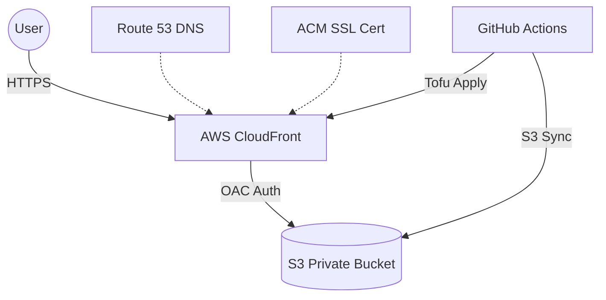

# JimMillerDrums.com

Professional drummer and in New York City. Focused on groove, reliability, and
helping the band sound better.

This project is a "Monorepo" containing both the static site source and the
cloud infrastructure required to host it. As a backend engineer, I wanted
to build a production-grade pipeline that is secure, cost-effective
(approx. $0.50/mo), and fully automated.

## 🏗 Architecture

The site uses a "Zero Public S3" posture. Traffic is served via CloudFront
using **Origin Access Control (OAC)** to ensure the S3 bucket remains private.

